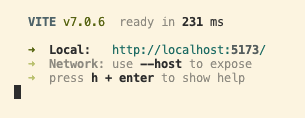
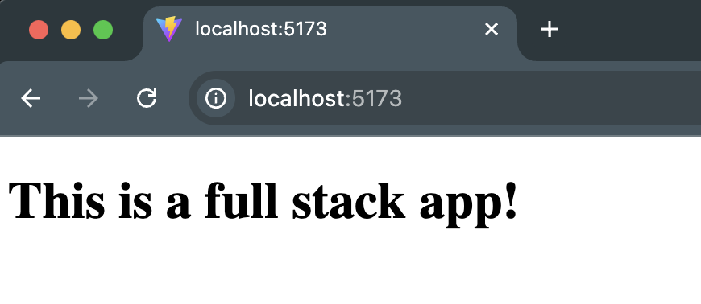

# ARTHIVE

ArtHive is a creative platform designed for artists of all levels who want inspiration and community. Each week, the app sends out a unique art challenge to spark creativity and encourage participation. Artists can upload their work, explore others’ submissions, and engage with the community through feedback and support. By combining structured challenges with a collaborative space, ArtHive helps artists stay motivated, improve their skills, and share their creativity with a wider audience.

## MVP Features

#### 🎨 Weekly Art Challenges

View current active challenge with topic, description, and deadlines. All users can browse challenges without authentication.

#### 🖼️ Artwork Gallery

Browse and interact with submitted artworks in a responsive grid layout. Features sorting, detailed artwork modals, and community engagement through likes.

#### 📤 Artwork Submission

Upload artwork (JPG/PNG up to 5MB) with title, description, and optional social media links. Real-time preview and validation included.

#### 👤 User Authentication

Secure login via Google OAuth or JWT tokens. Role-based access for participants and administrators.

#### 🏆 Top Artworks Showcase

Dedicated section displaying the top 5 most-liked artworks with quick access to detailed views.

#### ⚙️ Admin Management

Comprehensive admin panel for challenge management, content moderation, and user administration.

## Application Set-Up Instructions

1. Clone the repository

```
git clone https://github.com/Code-the-Dream-School/jj-practicum-team-4-front

cd jj-practicum-team-4-front
```

2. install dependencies

```
npm install
```

3. Create `.env` file in the root directory

4. Add the following variables in the `.env` file

```
VITE_API_URL=http://localhost:8000
VITE_GOOGLE_AUTH_URL=http://localhost:8000/auth/google
```

5. Run the application

```
npm run dev
```

6. Open http://localhost:5173/ with your browser to view the app.

## Tech Stack

#### Core Framework

- React 19
- Vite - Build tool and development server
- React Router - Client-side routing

#### UI Framework & Styling

- @mui/material - Material-UI components
- @mui/icons-material - Material-UI icons
- @emotion/react & @emotion/styled -CSS-in-JS styling

#### State Management & HTTP

- React Context & useReducer - State management
- Axios - HTTP client for API calls
- jwt-decode - JWT token decoding

#### Authentication

<!-- Google OAuth integration -->

#### Development Tools

- ESLint & Prettier - Code linting and formatting

## Demo Link & Screenshots

<!-- Demo link and screenshots will be displayed once all app design and functions are done. -->

## Team Members & Roles

- _Joy Sangsrichan_ - Lead mentor
- _Amir_ - React/Node mentor
- _Tarun Surendra Mothukuru_ - React/Node mentor
- _Uma Sekar_ - Assistant mentor (Front-End)
- _Maria Zasypkina_ - Assistant mentor(Back-End)
- _Iris Mejia_ - Node Student
- _Emiri Sato_ - React Student

<!--
# Front-End Repo for Node/React Practicum

This will be the front-end for your team's practicum project.

It is suggested that you run these instructions **after** you setup the back-end server first.
You can go through these steps during your first group meeting in case you need assistance from your mentors.

You will have two folders inside one team folder (one for front-end and one for back-end). Name the parent folder something appropriate (in the below example we title it "Practicum Project"). Then clone directly (do not fork and clone) the front and back repos while inside the parent ("Practicum Project") project folder.


> The front-end app (React) will be running on port 5173. The back-end server will be running on port 8000. You will need to run both the front-end app and the back-end server at the same time to test your app.

### Setting up local development environment

1. Clone this repository to the folder that was already created for both the front-end and back-end repos
2. Run `npm install` to install dependencies
3. Pull the latest version of the `main` branch (when needed)
4. Run `npm run dev` to start the development server
5. Open http://localhost:5173 with your browser to see the data received the back-end server.
6. Now you have your front-end and back-end running locally!

#### Running the front-end server in Visual Studio Code

Note: In the below example, the group's front-end repository was named `bb-practicum-team1-front` and the back-end repository was named `bb-practicum-team-1-back`. Your repository will have a different name, but the rest should look the same.



#### Running the front-end server in the browser

 -->
